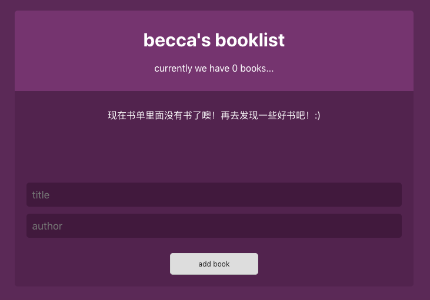
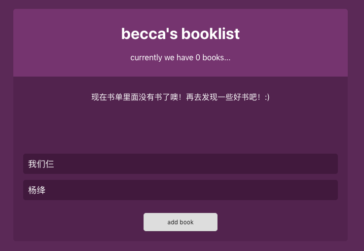
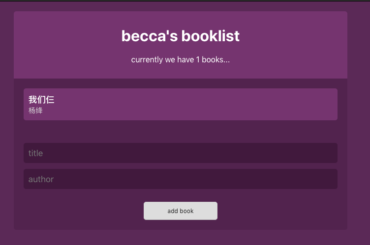
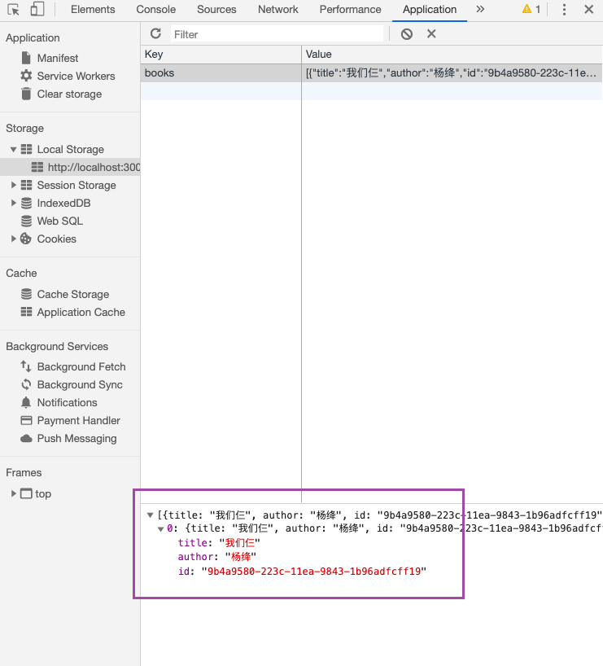
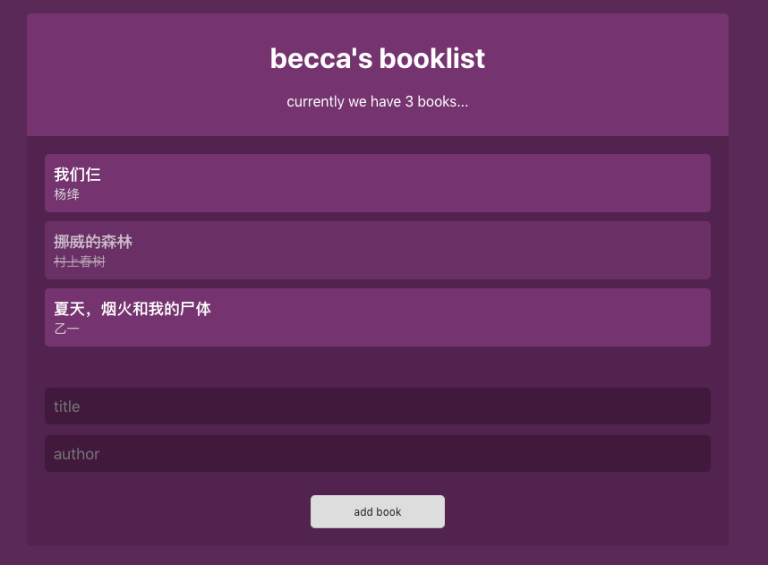

### learn-react-context-and-hooks

---
#### 下载项目文件
```
git clone https://github.com/sincerity628/learn-react-context-and-hooks.git
```
#### 安装依赖
```
cd learn-react-context-and-hooks
npm install
```
#### 运行项目
```
npm start
```
---
#### :eyes: 项目截图
* 首页：展示书名和作者名清单



* 添加书籍



* 添加成功



* 所添加书籍存放至localStorage（重新刷新页面，记录也不会消失）



* 删除书籍（将鼠标放置需要删除的书籍上会出现相应动态效果，点击即可删除）


